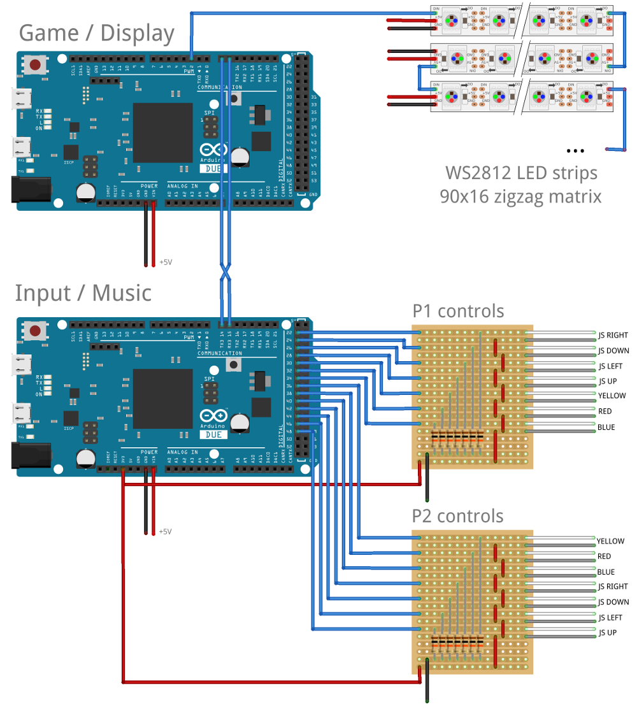

ArduinoPixels
=============

This is the Code for an Arduino based video game, originally designed by 
Kris Temmerman (@neuroprod).

See this blog post for details of the original implementation:
http://www.neuroproductions.be/arduino/arduino-video-game/

Getting started
===============

The game code can be run on an Arduino Due or, using Cinder, on a Mac or Windows PC.

Arduino
-------

Prerequisites:

- 2 Arduino Due boards (one running the game, one handling input and music)
- Arduino IDE 1.5.x (must support Arduino Due)

1. Copy all folders from `libraries` into your Arduino library folder (usually `~/Arduino/libraries`).
2. Open the `PixelDisplayGame/PixelDisplayGame.ino` sketch in the Arduino IDE
3. Set Tools -> Board -> Arduino Due
4. Compile and upload the sketch to the first Arduino Due - the one that will run the display and game logic.
5. Open the `pixelGameController/pixelGameController.ino` sketch in the Arduino IDE
6. Compile and upload the sketch to the second Arduino Due - this will handle the joysticks and music playback.

Now build the hardware as described [here](#hardware) and enjoy the game!

Windows
-------

Prerequisites:

- Visual Studio Express 2012 for Windows Desktop (http://www.microsoft.com/de-de/download/details.aspx?id=34673)
- Cinder for Visual C++ 2012 (http://libcinder.org/download/)

1. Set an environment variable named `CINDER_HOME`, pointing to the directory where you extracted Cinder
2. Open the file `vc11\ArduinoPixels\ArduinoPixels.sln` in Visual Studio 2012
3. Set the `pixelGameApp` project as StartUp project
4. Compile & Run!

Mac
---

Prerequisites:

- XCode
- Cinder for Mac (http://libcinder.org/download/)

TODO describe Mac setup

Hardware
========

Display
-------

The display is a 90x16 matrix of WS2812 RGB LEDs (16 strips, 90 LEDs each).
The strips are connected in a "zigzag" configuration, that means the "DO" pad of one strip is connected to the "DI" pad of the next one. A single data line, connected to pin 2 of the Arduino, is sufficient to drive the whole display.

Power should be fed from both sides of each strip to avoid brightness falloff on one side. Depending on the brightness, the display can draw up to 60A at 5V, so a good power supply and thick cables should be used.

Player Controls
---------------

Each player has a 4-way arcade joystick and 3 buttons ("red", "yellow", "blue"), connected to Arduino pins 22 through 48 (see above diagram for the exact wiring).  All buttons need a pulldown resistor.

The two Arduinos are connected using the "Serial3" serial port (pins 14 and 15). Make sure to swap RX and TX on one side.

License
=======

The code is licensed under an MIT license, assets are licensed under Creative-Commons Attribution.

Contributors
============

- Kris Temmerman - original design and implementation
